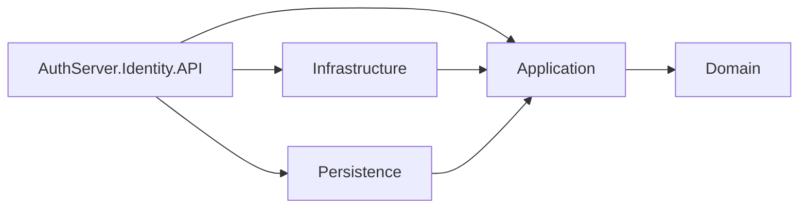

# AuthServer-Onion — Identity (Auth) + Catalog APIs (Onion Architecture)

**English • Türkçe**

[](https://dotnet.microsoft.com/)
[](https://learn.microsoft.com/dotnet/csharp/)
[](LICENSE)
[](https://github.com/Serbaycam/AuthServer-Onion)

> A multi-project **.NET** solution that demonstrates an **onion/clean architecture** approach around an **Identity/Auth API** (token issuer) and a sample downstream **Catalog API** (protected resources).  
> **“Onion” here means *Onion Architecture* (Clean Architecture style)** — not Tor / onion services.

---

## Table of contents

- [English](#english)
  - [What is this?](#what-is-this)
  - [Solution structure](#solution-structure)
  - [Onion Architecture in 30 seconds](#onion-architecture-in-30-seconds)
  - [Quick start (local)](#quick-start-local)
  - [Typical authentication flow (example)](#typical-authentication-flow-example)
  - [Configuration](#configuration)
  - [Database & migrations (if using EF Core)](#database--migrations-if-using-ef-core)
  - [Related repository (N‑Tier version)](#related-repository-n-tier-version)
  - [Contributing](#contributing)
  - [License](#license)
- [Türkçe](#türkçe)
  - [Bu repo nedir?](#bu-repo-nedir)
  - [Çözüm yapısı](#çözüm-yapısı)
  - [Onion Architecture mantığı (çok kısa)](#onion-architecture-mantığı-çok-kısa)
  - [Hızlı başlangıç (lokalde çalıştırma)](#hızlı-başlangıç-lokalde-çalıştırma)
  - [Tipik auth akışı (örnek)](#tipik-auth-akışı-örnek)
  - [Konfigürasyon](#konfigürasyon-1)
  - [Database & migrations (EF Core kullanıyorsan)](#database--migrations-ef-core-kullanıyorsan)
  - [İlgili repo (N‑Tier versiyonu)](#ilgili-repo-n-tier-versiyonu)
  - [Katkı](#katkı)
  - [Lisans](#lisans)

---

## English

### What is this?

This repository is a learning/reference project that shows how you can structure a backend solution with **Onion Architecture**:

- Separate **API** from **core business concerns**
- Keep **Domain** clean (framework & database independent)
- Put use-cases and contracts into **Application**
- Implement external concerns in **Infrastructure / Persistence**
- Demonstrate token-based protection via a second sample API (Catalog)

> ⚠️ Note: Exact routes, DTO names and ports can vary depending on your implementation.  
> The most reliable source is always the **Swagger UI** and the controller/source code.

---

### Solution structure

At the root you’ll find `AuthServer.Identity.sln` and the following projects/folders:

- `AuthServer.Identity.API` — Identity/Auth API (entry point)
- `AuthServer.Catalog.API` — Sample API (consumer of JWT / protected endpoints)
- `AuthServer.Identity.Domain` — Domain entities, enums, core rules (no infrastructure dependencies)
- `AuthServer.Identity.Application` — Use-cases, DTOs, service abstractions, validations
- `AuthServer.Identity.Persistence` — DB access layer (e.g., EF Core DbContext, repositories, migrations)
- `AuthServer.Identity.Infrastructure` — Cross-cutting implementations (token generation, hashing, external services, etc.)

---

### Onion Architecture in 30 seconds

The key idea is: **dependencies point inward**.

- **Domain** knows nothing about database/web/frameworks
- **Application** depends on Domain and defines interfaces/ports
- **Infrastructure / Persistence** implement those interfaces
- **API** wires everything together (DI) and exposes HTTP endpoints



---

### Quick start (local)

#### 1) Clone

```bash
git clone https://github.com/Serbaycam/AuthServer-Onion.git
cd AuthServer-Onion
```

#### 2) Open the solution

- Open: `AuthServer.Identity.sln` (Visual Studio / Rider)  
  or use CLI.

#### 3) Configure settings

Check `appsettings.json` / `appsettings.Development.json` in your API projects (typically in):

- `AuthServer.Identity.API`
- `AuthServer.Catalog.API`

Common things you may need to set:

- Database connection string (e.g., `ConnectionStrings:DefaultConnection`)
- JWT options (Issuer/Audience/Key/Expiration)
- Any seed/admin user settings (if you added them)

> Tip: If you’re not sure where the API is listening, look at the console output after `dotnet run`.

#### 4) Run

```bash
dotnet restore
dotnet run --project AuthServer.Identity.API
```

In a second terminal:

```bash
dotnet run --project AuthServer.Catalog.API
```

#### 5) Test (Swagger)

If Swagger is enabled, both APIs usually expose Swagger UI at `/swagger`.  
Open the URLs printed in the console and try the endpoints.

---

### Typical authentication flow (example)

Your exact endpoint names may differ, but a common flow is:

1. **Register** a user (Identity API)
2. **Login** and get an `access_token` (and optionally a `refresh_token`)
3. Call **Catalog API** endpoints with:

```
Authorization: Bearer <access_token>
```

---

### Configuration

This repo follows the typical **ASP.NET Core configuration** approach:

- `appsettings.json` for defaults
- `appsettings.Development.json` for local overrides
- Environment variables (optional) for CI/CD / production

Suggested keys you’ll commonly see in auth projects (names may differ):

```jsonc
{
  "ConnectionStrings": {
    "DefaultConnection": "Server=...;Database=...;User Id=...;Password=...;"
  },
  "Jwt": {
    "Issuer": "your-issuer",
    "Audience": "your-audience",
    "Key": "a-very-long-secret-key",
    "AccessTokenMinutes": 30
  }
}
```

> Keep secrets out of Git history. For local dev, prefer `user-secrets` or environment variables.

---

### Database & migrations (if using EF Core)

If your Persistence layer uses EF Core, you’ll usually do:

```bash
# Example only — adjust project names if you changed them
dotnet ef database update \
  --project AuthServer.Identity.Persistence \
  --startup-project AuthServer.Identity.API
```

If you want to create migrations:

```bash
dotnet ef migrations add InitialCreate \
  --project AuthServer.Identity.Persistence \
  --startup-project AuthServer.Identity.API
```

---

### Related repository (N‑Tier version)

If you prefer a classic multi-layer (N‑Tier) layout, check:

- **AuthServer-NTier** → https://github.com/Serbaycam/AuthServer-NTier

---

### Contributing

PRs and improvements are welcome:

1. Fork the repo  
2. Create a feature branch  
3. Commit your changes with a short description  
4. Open a Pull Request

Even small improvements (docs, cleanup, examples) are helpful 🙌

---

### License

This project is licensed under the **MIT License** — see [LICENSE](LICENSE).

---

## Türkçe

### Bu repo nedir?

Bu repo, **Onion Architecture / Clean Architecture** yaklaşımıyla kurgulanmış bir .NET çözüm örneğidir:

- **API** ile **core business** alanını ayırır
- **Domain** katmanını framework & DB bağımsız tutar
- Use-case’leri ve kontratları **Application** katmanına taşır
- Dış bağımlılıkları **Infrastructure / Persistence** tarafında çözer
- İkinci bir örnek API (Catalog) ile token bazlı korumayı gösterir

> ⚠️ Not: Route’lar, DTO isimleri ve portlar projeye göre değişebilir.  
> En doğru kaynak her zaman **Swagger UI** ve ilgili controller/source kodudur.

---

### Çözüm yapısı

Root’ta `AuthServer.Identity.sln` ve aşağıdaki projeleri görürsün:

- `AuthServer.Identity.API` — Identity/Auth API (giriş noktası)
- `AuthServer.Catalog.API` — Örnek API (JWT tüketen / korunan endpoint’ler)
- `AuthServer.Identity.Domain` — Domain entity’leri, kurallar, enum’lar (framework bağımsız)
- `AuthServer.Identity.Application` — Use-case’ler, DTO’lar, servis arayüzleri/abstraction’lar
- `AuthServer.Identity.Persistence` — Veri erişimi (örn. EF Core DbContext, repository, migration)
- `AuthServer.Identity.Infrastructure` — Cross‑cutting implementasyonlar (token üretimi, hashing, vb.)

---

### Onion Architecture mantığı (çok kısa)

Özet: **bağımlılıklar içeriye doğru akar**.

- **Domain** → DB/Web/Framework bilmez
- **Application** → Domain’i kullanır, interface/port’ları tanımlar
- **Infrastructure/Persistence** → bu interface’leri uygular
- **API** → DI ile her şeyi birleştirir ve HTTP olarak dışarı açar


---

### Hızlı başlangıç (lokalde çalıştırma)

#### 1) Klonla

```bash
git clone https://github.com/Serbaycam/AuthServer-Onion.git
cd AuthServer-Onion
```

#### 2) Solution’ı aç

- `AuthServer.Identity.sln` (Visual Studio / Rider)  
  veya CLI ile çalış.

#### 3) Ayarları düzenle

API projelerinin içinde genelde:

- `appsettings.json`
- `appsettings.Development.json`

dosyalarını kontrol et.

Tipik düzenlenecek alanlar:

- DB connection string (`ConnectionStrings:DefaultConnection`)
- JWT ayarları (Issuer/Audience/Key/Expiration)
- Varsa seed/admin kullanıcı ayarları

> İpucu: Hangi URL’de ayağa kalktığını görmek için `dotnet run` sonrası console çıktısına bak.

#### 4) Çalıştır

```bash
dotnet restore
dotnet run --project AuthServer.Identity.API
```

İkinci terminal:

```bash
dotnet run --project AuthServer.Catalog.API
```

#### 5) Test (Swagger)

Swagger açıksa iki API’nin de Swagger UI’ı genelde `/swagger` altında olur.  
Console’da yazan URL’leri açıp endpoint’leri deneyebilirsin.

---

### Tipik auth akışı (örnek)

Senin projende endpoint isimleri farklı olabilir ama genel akış şu şekildedir:

1. **Register** (Identity API)
2. **Login** ile `access_token` (opsiyonel `refresh_token`)
3. Catalog API çağrılarında header’a:

```
Authorization: Bearer <access_token>
```

---

### Konfigürasyon

Bu repo, klasik **ASP.NET Core configuration** yaklaşımını izler:

- Default ayarlar: `appsettings.json`
- Local override: `appsettings.Development.json`
- Prod/CI: environment variable (opsiyonel)

Auth projelerinde sık görülen örnek yapı (isimler sende farklı olabilir):

```jsonc
{
  "ConnectionStrings": {
    "DefaultConnection": "Server=...;Database=...;User Id=...;Password=...;"
  },
  "Jwt": {
    "Issuer": "your-issuer",
    "Audience": "your-audience",
    "Key": "a-very-long-secret-key",
    "AccessTokenMinutes": 30
  }
}
```

> Secret’ları repoya basma. Local’de `user-secrets` veya environment variable kullanmak daha sağlıklıdır.

---

### Database & migrations (EF Core kullanıyorsan)

Eğer Persistence katmanı EF Core ile çalışıyorsa genelde:

```bash
# Sadece örnek — proje adları sende farklıysa düzenle
dotnet ef database update \
  --project AuthServer.Identity.Persistence \
  --startup-project AuthServer.Identity.API
```

Migration oluşturmak istersen:

```bash
dotnet ef migrations add InitialCreate \
  --project AuthServer.Identity.Persistence \
  --startup-project AuthServer.Identity.API
```

---

### İlgili repo (N‑Tier versiyonu)

Klasik N‑Tier versiyonu için:

- **AuthServer-NTier** → https://github.com/Serbaycam/AuthServer-NTier

---

### Katkı

Katkı yapmak istersen:

1. Fork’la  
2. Feature branch aç  
3. Değişiklikleri commit et (kısa açıklama yaz)  
4. Pull Request gönder

Docs düzeltmesi bile değerlidir 🙌

---

### Lisans

Bu proje **MIT License** ile lisanslıdır — detay için [LICENSE](LICENSE).
